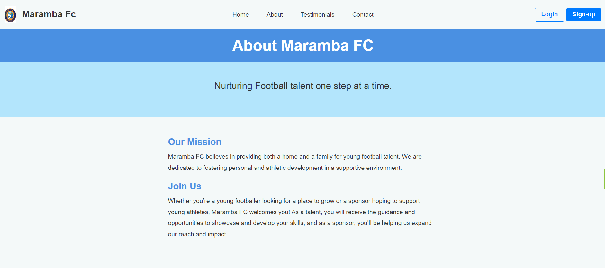

# Maramba FC Website

## Overview
The Maramba FC website is dedicated to nurturing young football talent while providing a supportive community for players and sponsors. Maramba FC believes in creating both a home and a family for aspiring footballers, enabling them to grow and excel in their abilities. The platform invites talents to join us and watch their skills flourish, while also encouraging sponsors to contribute and help us expand our reach.

## Features
- **Sign-Up Page:** Aspiring footballers and sponsors can easily sign up through a detailed registration form, providing personal and professional information.
    
    
    
- **Login Page:** Registered members can log in to manage their profiles and interactions with the club.
 
- **Hero Section:** A captivating introduction that outlines the club's mission: "Nurturing Football Talent One Step at a Time."

- **About Page:** An in-depth look at Maramba FC’s vision of fostering a nurturing environment for football talent and opportunities for growth for both players and sponsors.

- **Contact Page:** Visitors can reach out to the club via a contact form, fostering communication between players, sponsors, and management.

- **Testimonials Page:** Displays experiences and feedback from players and sponsors, showcasing the impact of Maramba FC.

## Application Domain
The **Maramba FC** website caters to:
- Sponsors and partners seeking to enhance club resources and support young talent.
- Organizations providing clear, accessible information about club programs and sponsorship opportunities.
- Football clubs and sports academies focused on athlete development.

## Tech Stack
- **Frontend:** HTML, CSS, JavaScript
- **Hosting:** GitHub Pages (or other hosting options)

